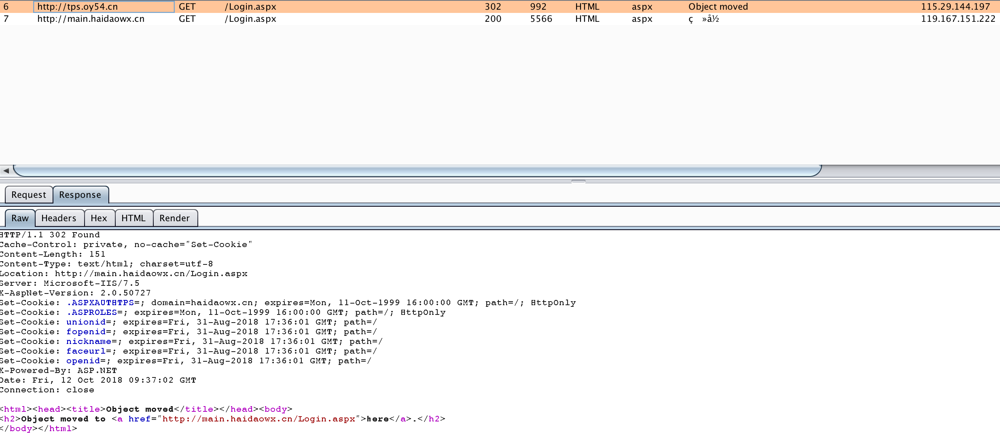
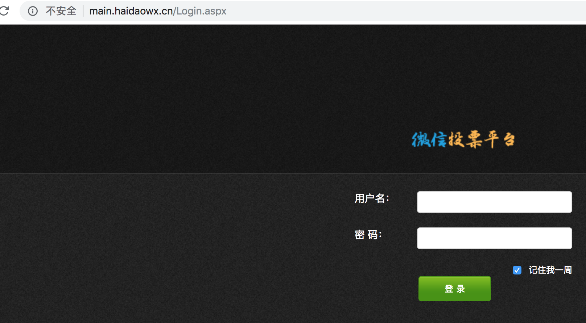
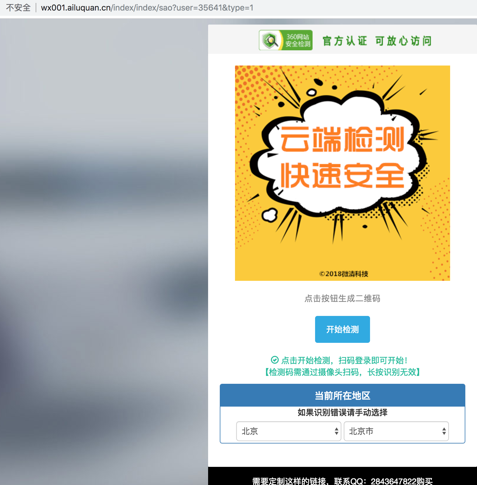

### domain
```
tps.oy54.cn
p1.mug0.cn
```
### 分析


1. http://tps.oy54.cn/Login.aspx
1. http://p1.mug0.cn/Login.aspx

redirect to

PC UA | Mobile UA
---|---
http://main.haidaowx.cn/Login.aspx | http://wx001.ailuquan.cn/index/index/sao?user=35641&type=1



### Whois
#### mug0.cn
```
蔡文学/13560062@qq.com
```
#### tps.oy54.cn
```
刘洁/13560062@qq.com
```
#### ailuquan.cn
```
王焱/3300308307@qq.com
```


### more info
```
domain：3300308307.com
支付宝：3300308307@qq.com==>信阳同城网络科技有限公司
ailuquan.cn==>a01.330123456.com:8088==>QQ1795955858==>王焰朋
```
### Qichacha

company | mobile | email | address | name
---|---
信阳同城网络科技有限公司 | 13033785072 | itwy88@163.com | 信阳市浉河区中山北路弘运鑫鑫广场写字楼1416号房 | 王焱


### Summary
此平台通过在手机上发布微信僵尸粉检测来获取用户信息，主要用途猜测: 
1. 投票
2. 文章访问量
3. 诈骗
4. 推广
